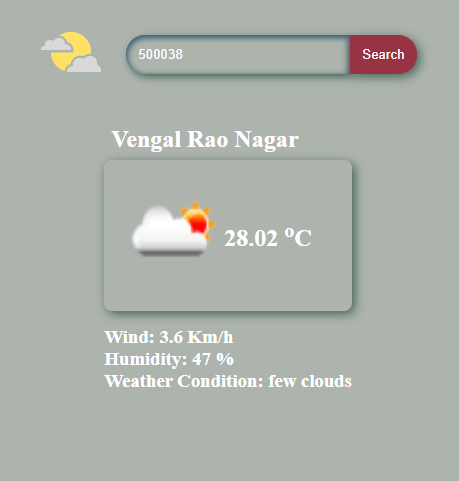

<h1 align="center">


Weather App</h1>

- This is a weather app using openweathermap.org API.
- This weather app gives weather info of various places in India using postal pin code.

---

## Screenshot



---

### How to use this weather app ?
Steps:
1. Goto openweathermap.org and Create an Account
2. From 'My API Keys' - copy your api key and paste it inside <kbd>weather.js</kbd> in this line 
   
   ```js 
   const APIKEY = 'Add your api';
   ```